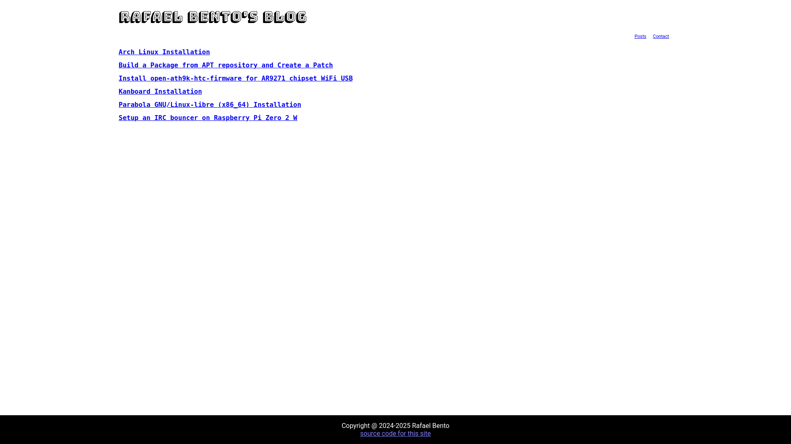
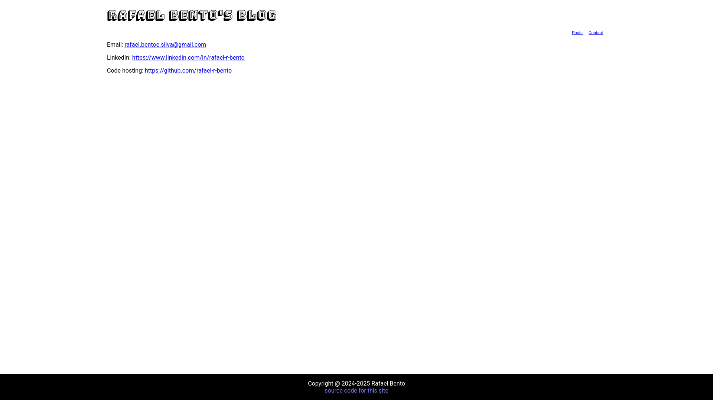

# Blog

A blog site template.

## Running

After clone the project, install dependencies with `npm install`. 

Run `npm start` for a dev server. Navigate to `http://localhost:4200/`. The application will automatically reload if you change any of the source files.

## Build

Run `npm run build` to build the project.
